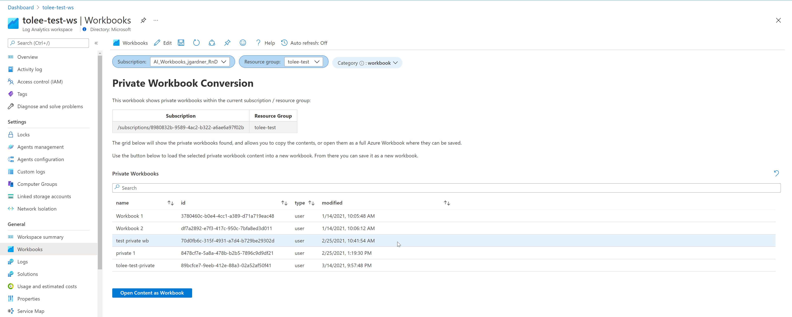
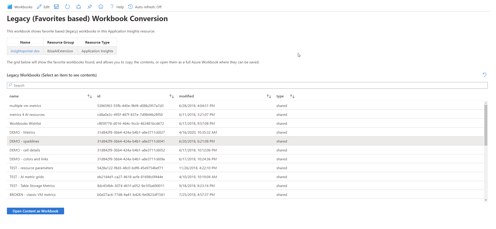

# Deprecated Workbook Retrieval Tool

Private and Legacy workbooks have been deprecated and are inaccessible from the Azure Portal UX. If you are here because you are looking for the deprecated workbook that you forgot to convert before the deadline, you're in luck! We've created a tool that will allow you to retrieve the content of your old workbook and load it into a new workbook so that you can save it as a new workbook.

_To move forward with the deprecation of these workbooks, this tool will only be available for a limited time.

## Private Workbook Retrieval
1. Open up a new or empty workbook
2. Go into Edit mode in the toolbar and navigate to the advanced editor
  
3. Copy the following (raw) workbook json and paste it into your open advanced editor: [Private Workbook Conversion](./PrivateWorkbookConversion.workbook)
4. Click Apply at the top right
5. Select the subscription and resource group and category of the workbook you'd like to retrieve. 
6. The grid at the bottom of this workbook will list all the private workbooks in the selected subscription / resource group above.
7. Click on one of the workbooks in the grid. Your workbook should look something like this:
  
8. Click the button at the bottom of the workbook labeled "Open Content as Workbook"
9. A new workbook view will appear with the content of the old private workbook that you selected. In that view you can save this as a standard Workbook.
10. Links to the deprecated workbook (or its contents), including dashboard pins and URL links, will need to be re-established with the newly created workbook in step 9.

## Favorites Based (Legacy) Workbook Retrieval
1. Navigate to your Application Insights Resource > Workbooks gallery
2. Open up a new or empty workbook
3. Click Edit in the toolbar and navigate to the advanced editor
  
4. Copy the following (raw) workbook json and paste it into your open advanced editor: [Legacy Workbook Conversion](./LegacyWorkbookConversion.workbook)
5. Click Apply at the top right
6. The grid at the bottom of this workbook will list all the legacy workbooks within the current AppInsights resource.
7. Click on one of the workbooks in the grid. Your workbook should now look something like this:
  
8. Click the button at the bottom of the workbook labeled "Open Content as Workbook"
9. A new workbook view will appear with the content of the old legacy workbook that you selected. In that view you can save this as a standard Workbook.
10. Links to the deprecated workbook (or its contents), including dashboard pins and URL links, will need to be re-established with the newly created workbook in step 9.